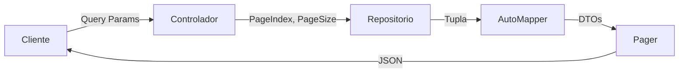

# 📄 Sistema de Paginación

> **Sistema completo de paginación para la API que permite dividir grandes conjuntos de datos en páginas más pequeñas y manejables, mejorando el rendimiento y la experiencia del usuario.**

---

## 📑 Tabla de Contenidos

- [Descripción General](#-descripción-general)
- [Componentes Principales](#-componentes-principales)
  - [Clase `Pager<T>`](#1-clase-pagert)
  - [Clase `Params`](#2-clase-params)
- [Implementación](#-implementación)
  - [Interfaz del Repositorio](#interfaz-igenericrepositoryt)
  - [Implementación Genérica](#implementación-genérica)
  - [Implementación Específica](#implementación-específica-en-productorepository)
- [Uso en Controladores](#-uso-en-controladores)
- [Ejemplos de Uso](#-ejemplos-de-uso)
- [Estructura de Respuesta](#-estructura-de-respuesta-json)
- [Ventajas](#-ventajas-de-la-implementación)
- [Extensibilidad](#-extensibilidad)
- [Notas Técnicas](#-notas-técnicas)

---

## 🎯 Descripción General

Se ha implementado un sistema de paginación completo para la API que permite dividir grandes conjuntos de datos en páginas más pequeñas y manejables. Esta funcionalidad mejora el rendimiento de la API y la experiencia del usuario al evitar cargar todos los registros de una vez.

### ✨ Características Principales

- ✅ **Paginación genérica** reutilizable para cualquier entidad
- ✅ **Validación automática** de parámetros
- ✅ **Límites de seguridad** para prevenir abusos
- ✅ **Metadatos completos** para navegación (páginas totales, página anterior/siguiente)
- ✅ **Valores por defecto** sensatos (5 registros por página)

---

## 🧩 Componentes Principales

### 1. Clase `Pager<T>`

La clase `Pager<T>` es una clase genérica ubicada en `API/Helpers/Helpers.cs` que encapsula la información de paginación y los registros de una página específica.

**Ubicación:** `API/Helpers/Helpers.cs`

```3:37:API/Helpers/Helpers.cs
public class Pager<T> where T : class
{
    public int PageIndex { get; set; }
    public int PageSize { get; set; }
    public int Total { get; set; }
    public IEnumerable<T> Registers { get; set; }

    public Pager(IEnumerable<T> registers, int total, int pageIndex, int pageSize)
    {
        Registers = registers;
        Total = total;
        PageIndex = pageIndex;
        PageSize = pageSize;
    }

    public int TotalPages
    {
        get
        {
            return (int)Math.Ceiling((double)Total / PageSize);
        }
       
    }

    public bool HasPreviousPage
    {
        get { return PageIndex > 1; }
    }

    public bool HasNextPage
    {
        get { return (PageIndex < TotalPages); }
    }

}
```

#### 📊 Propiedades de la Clase

| Propiedad | Tipo | Descripción |
|-----------|------|-------------|
| `PageIndex` | `int` | Número de la página actual (basado en 1) |
| `PageSize` | `int` | Cantidad de registros por página |
| `Total` | `int` | Total de registros en la base de datos |
| `Registers` | `IEnumerable<T>` | Lista de registros de la página actual |
| `TotalPages` | `int` | Número total de páginas (calculado automáticamente) |
| `HasPreviousPage` | `bool` | Indica si existe una página anterior |
| `HasNextPage` | `bool` | Indica si existe una página siguiente |

---

### 2. Clase `Params`

La clase `Params` ubicada en `API/Helpers/Params.cs` se utiliza para recibir y validar los parámetros de paginación desde la query string.

**Ubicación:** `API/Helpers/Params.cs`

```3:19:API/Helpers/Params.cs
public class Params
{
    private int _pageSize = 5;
    private const int MaxPageSize = 50;
    private int _pageIndex = 1;

    public int PageSize
    {
        get => _pageSize;
        set => _pageSize = (value > MaxPageSize) ? MaxPageSize : value;
    }
    public int PageIndex
    {
        get => _pageIndex;
        set => _pageIndex = (value < 1) ? 1 : value;
    }
}
```

#### ⚙️ Características y Validaciones

| Parámetro | Valor por Defecto | Valor Máximo/Mínimo | Validación |
|-----------|-------------------|---------------------|------------|
| `PageSize` | `5` | Máximo: `50` | Si excede 50, se establece en 50 |
| `PageIndex` | `1` | Mínimo: `1` | Si es menor que 1, se establece en 1 |

> 💡 **Nota:** La validación se realiza automáticamente mediante propiedades con setters que aplican las reglas de negocio.

---

## 🔧 Implementación

### Interfaz `IGenericRepository<T>`

Se agregó un nuevo método a la interfaz genérica para soportar paginación:

**Ubicación:** `Core/Interfaces/IGenericRepository.cs`

```16:16:Core/Interfaces/IGenericRepository.cs
Task<(int totalRegistros, IEnumerable<T> registros)> GetAllAsync(int pageIndex, int pageSize);
```

#### 📤 Valor de Retorno

El método retorna una tupla con:
- `totalRegistros`: Total de registros en la tabla
- `registros`: Lista de registros de la página solicitada

---

### Implementación Genérica

En `Infrastruture/Repositories/GenericRepository.cs` se implementa el método base:

**Ubicación:** `Infrastruture/Repositories/GenericRepository.cs`

```23:32:Infrastruture/Repositories/GenericRepository.cs
public virtual async Task<(int totalRegistros, IEnumerable<T> registros)> GetAllAsync(int pageIndex, int pageSize)
{
    var totalRegistros = await _context.Set<T>().CountAsync();
    var registros = await _context.Set<T>()
        .Skip((pageIndex - 1) * pageSize)
        .Take(pageSize)
        .ToListAsync();

    return (totalRegistros, registros);
}
```

#### 🔍 Lógica de Paginación

| Método | Descripción |
|--------|-------------|
| `Skip((pageIndex - 1) * pageSize)` | Salta los registros de las páginas anteriores |
| `Take(pageSize)` | Toma solo los registros de la página actual |

**Ejemplo de cálculo:**
- Página 1, tamaño 10: `Skip(0)` + `Take(10)` → registros 1-10
- Página 2, tamaño 10: `Skip(10)` + `Take(10)` → registros 11-20
- Página 3, tamaño 10: `Skip(20)` + `Take(10)` → registros 21-30

---

### Implementación Específica en `ProductoRepository`

El repositorio de productos sobrescribe el método para incluir las relaciones (Marca y Categoria):

**Ubicación:** `Infrastruture/Repositories/ProductoRepository.cs`

```44:54:Infrastruture/Repositories/ProductoRepository.cs
public override async Task<(int totalRegistros, IEnumerable<Producto> registros)> GetAllAsync(int pageIndex, int pageSize)
{
    var totalRegistros = await _context.Productos.CountAsync();
    var registros = await _context.Productos
        .Include(u => u.Marca)
        .Include(u => u.Categoria)
        .Skip((pageIndex - 1) * pageSize)
        .Take(pageSize)
        .ToListAsync();
    return (totalRegistros, registros);
}
```

> 🔗 **Incluye relaciones:** Esta implementación carga las entidades relacionadas (`Marca` y `Categoria`) usando `Include()` de Entity Framework Core.

---

## 🎮 Uso en Controladores

El controlador `ProductoController` utiliza la paginación en el endpoint `GET`:

**Ubicación:** `API/Controllers/ProductoController.cs`

```28:34:API/Controllers/ProductoController.cs
public async Task<ActionResult<Pager<ProductoListDTO>>> Get([FromQuery] Params productParams)
{
    var resultado = await _unitOfWork.Productos.GetAllAsync(productParams.PageIndex, productParams.PageSize);

    var listaProductosDTO = _mapper.Map<List<ProductoListDTO>>(resultado.registros);
    return Ok(new Pager<ProductoListDTO>(listaProductosDTO, resultado.totalRegistros, productParams.PageIndex, productParams.PageSize));
}
```

### 🔄 Flujo de Ejecución



1. 📥 Recibe los parámetros `PageIndex` y `PageSize` desde la query string
2. 🔍 Llama al método `GetAllAsync` del repositorio con estos parámetros
3. 🔄 Mapea los registros a DTOs usando AutoMapper
4. 📤 Retorna un objeto `Pager<ProductoListDTO>` con toda la información de paginación

---

## 💻 Ejemplos de Uso

### 📌 Ejemplo 1: Solicitud Básica (Valores por Defecto)

**Request:**
```http
GET /api/Producto
```

**Response:**
```json
{
  "pageIndex": 1,
  "pageSize": 5,
  "total": 25,
  "registers": [
    {
      "id": 1,
      "nombre": "Producto 1",
      "precio": 100.00,
      "marca": "Marca A",
      "categoria": "Categoría X"
    },
    {
      "id": 2,
      "nombre": "Producto 2",
      "precio": 150.00,
      "marca": "Marca B",
      "categoria": "Categoría Y"
    }
    // ... 3 registros más
  ],
  "totalPages": 5,
  "hasPreviousPage": false,
  "hasNextPage": true
}
```

---

### 📌 Ejemplo 2: Solicitud con Parámetros Personalizados

**Request:**
```http
GET /api/Producto?PageIndex=2&PageSize=10
```

**Response:**
```json
{
  "pageIndex": 2,
  "pageSize": 10,
  "total": 25,
  "registers": [
    {
      "id": 11,
      "nombre": "Producto 11",
      "precio": 200.00,
      "marca": "Marca C",
      "categoria": "Categoría Z"
    }
    // ... 9 registros más
  ],
  "totalPages": 3,
  "hasPreviousPage": true,
  "hasNextPage": true
}
```

---

### ⚠️ Casos Especiales

#### Caso 1: Página Inexistente

**Request:**
```http
GET /api/Producto?PageIndex=100&PageSize=5
```

**Comportamiento:**
- Retornará una página vacía con `registers: []`
- `hasNextPage: false`
- `hasPreviousPage: true` (si hay páginas anteriores)

---

#### Caso 2: PageSize Excesivo

**Request:**
```http
GET /api/Producto?PageSize=100
```

**Comportamiento:**
- Se limitará automáticamente a **50 registros** por página
- La validación ocurre en la clase `Params`

---

#### Caso 3: PageIndex Inválido

**Request:**
```http
GET /api/Producto?PageIndex=0
```

**Comportamiento:**
- Se establecerá automáticamente en **1** (primera página)
- La validación ocurre en la clase `Params`

---

## 📋 Estructura de Respuesta JSON

```json
{
  "pageIndex": 1,           // Número de página actual (basado en 1)
  "pageSize": 5,            // Registros por página
  "total": 25,              // Total de registros en la base de datos
  "registers": [            // Array de objetos (ej: ProductoListDTO)
    {
      "id": 1,
      "nombre": "...",
      // ... más propiedades
    }
  ],
  "totalPages": 5,          // Total de páginas (calculado)
  "hasPreviousPage": false, // ¿Existe página anterior?
  "hasNextPage": true       // ¿Existe página siguiente?
}
```

### 📊 Diagrama de Estructura

```
Pager<T>
├── PageIndex (int)
├── PageSize (int)
├── Total (int)
├── Registers (IEnumerable<T>)
├── TotalPages (int) [calculado]
├── HasPreviousPage (bool) [calculado]
└── HasNextPage (bool) [calculado]
```

---

## ✨ Ventajas de la Implementación

| Ventaja | Descripción |
|---------|-------------|
| 🚀 **Rendimiento** | Reduce la carga de datos transferidos y procesados |
| 📈 **Escalabilidad** | Funciona eficientemente incluso con grandes volúmenes de datos |
| 🔧 **Flexibilidad** | Permite personalizar el tamaño de página según las necesidades |
| 🔒 **Seguridad** | Limita el tamaño máximo de página para prevenir abusos |
| 📊 **Información Completa** | Proporciona metadatos útiles para la navegación |
| ♻️ **Reutilizable** | La clase `Pager<T>` es genérica y puede usarse con cualquier entidad |

---

## 🔨 Extensibilidad

Para agregar paginación a otros controladores, sigue estos pasos:

### 📝 Pasos para Implementar

1. **Verificar el Repositorio**
   ```csharp
   // Asegúrate de que el repositorio implemente el método
   Task<(int totalRegistros, IEnumerable<T> registros)> GetAllAsync(int pageIndex, int pageSize);
   ```

2. **Modificar el Controlador**
   ```csharp
   [HttpGet]
   public async Task<ActionResult<Pager<MiDTO>>> Get([FromQuery] Params params)
   {
       var resultado = await _unitOfWork.MiEntidad.GetAllAsync(params.PageIndex, params.PageSize);
       var listaDTO = _mapper.Map<List<MiDTO>>(resultado.registros);
       return Ok(new Pager<MiDTO>(listaDTO, resultado.totalRegistros, params.PageIndex, params.PageSize));
   }
   ```

3. **Usar AutoMapper** (opcional)
   - Mapea los registros a DTOs antes de crear el `Pager<T>`

4. **Probar el Endpoint**
   ```http
   GET /api/MiEntidad?PageIndex=1&PageSize=10
   ```

---

## 🔬 Notas Técnicas

### Implementación Interna

- **Entity Framework Core**: Utiliza `Skip()` y `Take()` para la paginación a nivel de base de datos
- **Cálculo de Páginas**: `Math.Ceiling()` redondea hacia arriba para obtener el total de páginas
- **Índices**: Los índices de página están basados en **1** (no en 0)
- **Validación**: La validación de parámetros se realiza automáticamente en la clase `Params`

### ⚡ Consideraciones de Rendimiento

| Aspecto | Detalle |
|---------|---------|
| **Consultas SQL** | Se ejecutan dos consultas: `COUNT()` y `SELECT` con `OFFSET`/`LIMIT` |
| **Memoria** | Solo se cargan los registros de la página actual en memoria |
| **Índices** | Asegúrate de tener índices apropiados en las columnas de ordenamiento |

### 🎯 Buenas Prácticas

- ✅ Usa valores de `PageSize` razonables (5-20 para la mayoría de casos)
- ✅ Implementa caché si los datos no cambian frecuentemente
- ✅ Considera agregar ordenamiento (`OrderBy`) para resultados consistentes
- ✅ Documenta los límites de `PageSize` en tu API

---

## 📚 Referencias

- **Archivo Principal:** `API/Helpers/Helpers.cs`
- **Parámetros:** `API/Helpers/Params.cs`
- **Controlador de Ejemplo:** `API/Controllers/ProductoController.cs`
- **Repositorio Genérico:** `Infrastruture/Repositories/GenericRepository.cs`
- **Repositorio Específico:** `Infrastruture/Repositories/ProductoRepository.cs`

---

<div align="center">

**Documentación generada para el Sistema de Paginación** 📄

</div>
